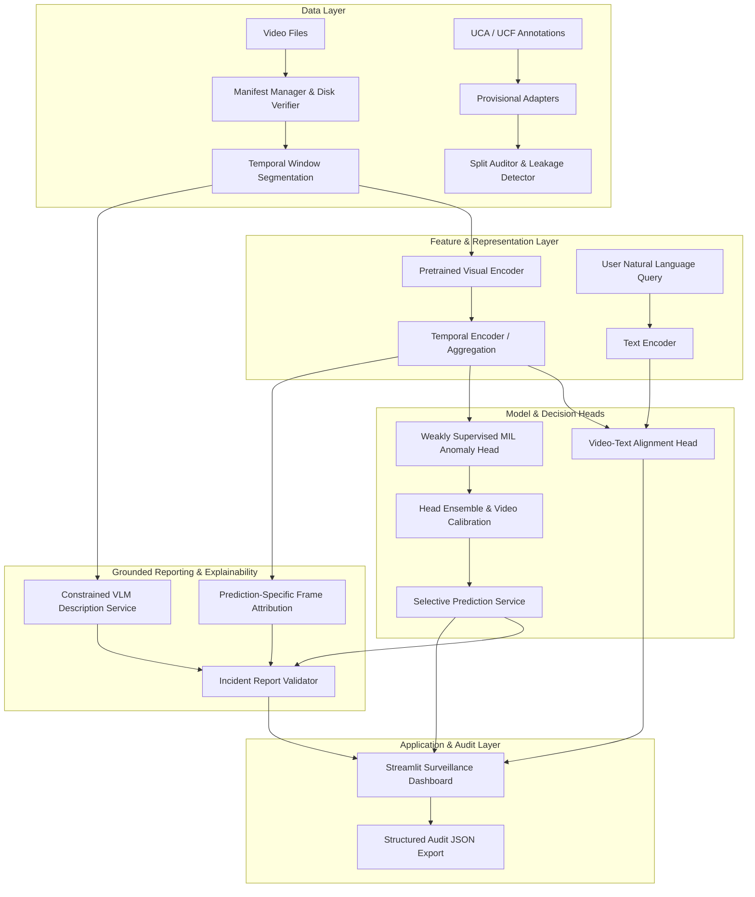

# Sentinel-VL Architecture

## 1. System Overview

Sentinel-VL is designed as a modular monolith providing software-only surveillance video understanding. It decouples offline feature extraction, retrieval alignment, and weakly supervised multiple-instance learning (MIL) from inference, uncertainty quantification, explainability, and user review.

---

## 2. Layer Responsibilities & Contracts

### 2.1 Data Layer (`sentinel_vl.data`)
- **Schemas (`schemas.py`):** Typed internal contracts (`VideoRecord`, `CaptionSegment`, `AnomalyWindow`, `DataManifest`, `SplitPartition`).
- **Manifest Manager (`manifest.py`):** Validates temporal intervals (`start_seconds < end_seconds`), verifies video duration bounds, checks cross-references, and inspects physical video files on disk.
- **Split Auditor (`split_auditor.py`):** Strictly enforces source-video isolation (all temporal windows belonging to a given video ID stay in exactly one split). Audits train/val/test disjointness and detects cross-protocol contamination between retrieval and anomaly tasks.
- **Adapters (`uca_adapter.py`):** Maps upstream raw files into internal records. Marked strictly `PROVISIONAL` and `UNVERIFIED` until Milestone M1 inspects a verified sample.

### 2.2 Model Layer (`sentinel_vl.models`)
- **Base Interfaces (`base.py`):** Abstract contracts for `BaseVisualEncoder`, `BaseTemporalEncoder`, `BaseAlignmentHead`, and `BaseAnomalyHead`.
- **Decoupled Architecture:** Encoders are frozen feature extractors; temporal aggregators and anomaly heads are lightweight modules trained offline.

### 2.3 Training Layer (`sentinel_vl.training`)
- **Offline Training Only:** Model training is decoupled from the UI and inference pipelines. Training is never triggered during user interactions.
- **Retrieval Training:** Symmetric contrastive loss with candidate pool multi-positive handling.
- **Anomaly Training:** Multiple-instance learning (MIL) with top-k mean window score aggregation against video-level ground truth.

### 2.4 Uncertainty & Selective Prediction (`sentinel_vl.uncertainty`)
- **UQ Contracts (`contracts.py`):** Represents raw score, calibrated probability, ensemble disagreement, and selective decisions.
- **Granularity Rule:** Video-level predictions are calibrated on a dedicated video-level labeled calibration partition. Segment-level scores remain weakly supervised and are explicitly labeled as uncalibrated.
- **Selective Abstention:** Returns `accepted_normal`, `accepted_anomalous`, or `review_required`.
- **Risk-Coverage Invariant:** If coverage is 0.0, risk is mathematically undefined (`None`), never misrepresented as 0.0 or NaN. Review rate (`1.0 - coverage`) is always reported alongside risk.

### 2.5 Explainability & XAI (`sentinel_vl.explainability`)
- **Targeted Attribution:** Attribution is explicitly tied to a named model output (e.g., anomaly head score or retrieval cosine similarity).
- **Perturbation Testing:** Evaluates frame removal against random removal controls rather than relying solely on visual saliency heatmaps.

### 2.6 Incident Reporting (`sentinel_vl.reporting`)
- **Structured Schema (`schemas.py`):** Validates interval bounds, peak anomaly score, decision, evidence frame IDs, and provenance.
- **Evidence Verification:** Enforces that referenced frame IDs exist within the candidate video clip.
- **Ethical Safeguard:** Prohibits inflammatory or legally conclusive labels (e.g., "guilty", "crime confirmed").
- **Auditability:** Generated text is marked `generated_unreviewed` until signed off by a human operator (`human_reviewed` or `rejected`).

### 2.7 Application Layer (`app.streamlit_app`)
- **Synthetic Demo Safeguard:** In Milestone M0, runs in explicitly labeled synthetic demo mode with full provenance tagging (`provenance="synthetic_demo"`).
- **Security Engineering:** Bounded file upload size (max 50MB), HTML escaping on exported fields, and strictly no arbitrary code execution or external tool calls from model outputs.

---

## 3. Scientific Invariants

| Principle | Scientific Rationale |
|---|---|
| **Weak supervision ≠ Segment ground truth** | Video-level labels only establish that an anomaly occurred somewhere in the video bag; individual window scores remain uncalibrated localized estimates. |
| **Retrieval score ≠ Anomaly probability** | Semantic similarity between text and video does not measure abnormality or violation of security policy. |
| **VLM fluency ≠ Factuality** | Foundation vision-language models can hallucinate. Descriptions are bounded outputs requiring human review, not ground-truth evidence. |
| **Granular calibration** | Calibration parameters (e.g., temperature scaling) are fitted only at the granularity supported by held-out calibration labels (video-level). |
| **Source-video partitioning** | Neighboring temporal segments from the same source video share camera context and background. Splitting frames from the same video across train and test causes catastrophic leakage. |

