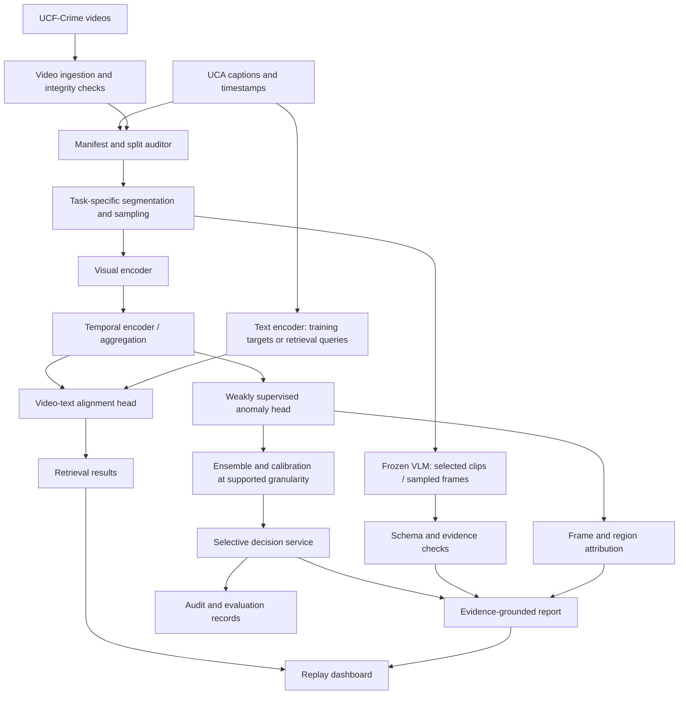

# Sentinel-VL: Uncertainty-Aware and Explainable Video–Language Understanding for Security Monitoring

Full project proposal and implementation blueprint  
Prepared: 9 October 2026  
Revision: UCA + UCF-Crime edition  
Status: Proposed research design. No implemented performance or experimental results are claimed.

## 1. Executive summary

Sentinel-VL is a software-only security-monitoring research system that analyzes recorded surveillance video, retrieves relevant events using natural-language queries, estimates the reliability of anomaly predictions, and produces evidence-linked descriptions for human review.

The primary dataset is UCA (UCF-Crime Annotation), paired with its corresponding UCF-Crime videos. UCA provides 1,854 videos, 23,542 human-written sentences, temporal event boundaries, and training/validation/test annotations. It was introduced in the CVPR 2024 work “Towards Surveillance Video-and-Language Understanding: New Dataset, Baselines, and Challenges.” [web:107][web:105]

The project combines:

- Computer vision: spatial and temporal representations of video.
- NLP: event-description encoding and natural-language queries.
- Vision–language learning: video/text alignment and grounded event description.
- Uncertainty quantification: calibration and abstention for a precisely defined anomaly-prediction head.
- XAI: frame/region attribution, query sensitivity, and evidence-grounding evaluation.
- Security development: privacy-conscious processing, bounded interfaces, auditability, and human-reviewed incident reporting.

No robot, custom recordings, or synthetic environment is required. A future robot may consume the same perception API, but this dataset cannot validate navigation, motor safety, or mission-authorization security.

## 2. Changes from the original RoboGuard proposal

| Original design | Revised design |
|---|---|
| Autonomous indoor patrol | Offline surveillance-video analysis |
| Custom robot-centric simulation dataset | Existing UCA annotations + UCF-Crime footage |
| Blocked exits and map-defined zone events | Observable events supported by the supplied annotations |
| Navigation and action gate as core modules | Retrieval, anomaly scoring, calibration, and grounded reporting |
| Environmental prompt injection as main security experiment | Event-understanding reliability as the main research problem |
| ROS 2 / Nav2 mandatory | Optional future interface only |
| Physical deployment evaluation | Reproducible held-out video evaluation |

The name changes to Sentinel-VL to avoid implying that the core experiments evaluate a robot.

## 3. Problem statement and scope

### 3.1 Problem

A useful monitoring system should do more than emit an anomaly score. It should identify relevant temporal segments, explain what it observed, and distinguish confident findings from cases requiring human review.

The research challenge is to integrate video understanding and language without allowing fluent descriptions to conceal unreliable predictions or unsupported claims.

### 3.2 Main use cases

1. Text-to-video retrieval: “Find clips showing a person running away.”
2. Video-to-text retrieval: rank reference descriptions for a selected clip.
3. Anomaly scoring: assign a score to sampled video segments under a defined labeling protocol.
4. Selective prediction: withhold low-reliability decisions for review.
5. Grounded description: describe visible events without inventing identity, intent, or hidden actions.
6. Evidence visualization: show influential frames, regions, and score timelines.

### 3.3 Scope restrictions

- Recorded videos first, not operational live surveillance.
- No identity recognition or inference of criminal intent.
- No autonomous enforcement or physical intervention.
- No claim of universal crime detection.
- No claim that a caption explains a classifier's internal computation.
- No training of a foundation VLM from scratch.
- No claim that dataset anomaly categories establish legal wrongdoing.
- No requirement for robotics, cloud services, continual learning, or federated learning.

Some underlying footage contains violence and disturbing events. Handle demonstrations and annotation review accordingly. [web:106]

## 4. Objectives and research questions

### 4.1 Objectives

O1. Construct a reproducible video/text data pipeline using official annotations.

O2. Establish text-to-video retrieval before adding a more complex monitoring task.

O3. Train a weakly supervised anomaly model using appropriate UCF-Crime labels.

O4. Calibrate predictions at the granularity supported by held-out ground truth.

O5. Evaluate selective prediction, attribution faithfulness, and report grounding.

O6. Deliver a replay dashboard, reproducible experiments, and a complete thesis report.

### 4.2 Research questions

- RQ1: How well can aligned video/text embeddings retrieve surveillance events?
- RQ2: Does temporal modeling improve anomaly detection over a frame-aggregation baseline?
- RQ3: Does calibration and abstention reduce errors among accepted predictions?
- RQ4: Do highlighted frames and regions meaningfully influence the predictions they are claimed to explain?
- RQ5: Can constrained VLM reporting reduce unsupported statements compared with unconstrained generation?

### 4.3 Hypotheses and novelty

Expected improvements are hypotheses, not guarantees. Combining CV, NLP, UQ, XAI, and a VLM is not itself a novel contribution.

A defensible contribution could be a reproducible evaluation linking selective anomaly prediction to evidence-grounded reports, including negative findings, or a carefully controlled uncertainty-aware temporal-explanation study. Confirm novelty through a literature review before finalizing the thesis claim.

## 5. Dataset recommendation and roles

### 5.1 UCA: primary video–language supervision

UCA provides human-written descriptions of temporally localized events in selected UCF-Crime videos. Its annotations are available in JSON/TXT formats with supplied partitions. The timing annotation uses 0.1-second precision; this is not a guarantee that every boundary is objectively accurate to that tolerance. [web:107][web:105]

Use UCA for:

- Video/text alignment.
- Text-to-video and video-to-text retrieval.
- Grounded event-description evaluation.
- Optional sentence-to-video temporal grounding.

Do not treat all UCA sentences as abnormal-event labels. A sentence may describe normal context or an observable action without establishing anomalousness.

### 5.2 UCF-Crime: videos and anomaly supervision

UCF-Crime supplies the underlying surveillance videos and an anomaly-detection task covering 13 anomaly categories. Its original research setting uses weak supervision; the project also provides original anomaly-detection test annotations. [web:106]

Use it for:

- Video acquisition matched to UCA IDs.
- Weakly supervised anomaly training using verified video-level labels.
- Temporal anomaly evaluation where appropriate temporal ground truth is available.

Not every UCF-Crime video is included in UCA: UCA uses a selected subset. Preserve this distinction in all counts and tables. [web:104]

### 5.3 Dataset access checklist

Use the official UCA project page and repository for annotations and mapping instructions, and the official UCF-Crime project for video sources. Annotation files alone do not include the footage. [web:108][web:107][web:106]

Before training:

1. Confirm access to the actual video files.
2. Review video and annotation usage conditions separately.
3. Match video names/IDs against UCA records.
4. Verify durations, decoding, timestamps, and missing files.
5. Create a manifest documenting which videos are usable.
6. Record any unavailable videos and resulting protocol changes.

Public availability does not imply unrestricted commercial reuse. The UCA release specifies research/academic use. [web:107][web:108]

### 5.4 Why not another primary dataset?

- ShanghaiTech is useful for anomaly detection but is not the chosen source of aligned language supervision. [web:84]
- UBnormal is attractive for pixel-level anomaly localization, but does not replace UCA's event-language supervision in this design. [web:98]
- XD-Violence adds audio; audio is outside the first implementation. [web:97]
- Custom robot data would add collection and annotation work the user explicitly wants to avoid.

No dataset is universally perfect. UCA + UCF-Crime is selected because it fits the proposed tasks and existing-data constraint.

## 6. Split design and leakage prevention

### 6.1 Separate task protocols

Maintain two explicit protocols:

A. Retrieval/captioning: use the supplied UCA partitions.

B. Anomaly detection: use the verified UCF-Crime anomaly protocol or a fully documented new video-level partition.

Before joint training, audit video membership across both protocols. A video used for training in one task must not silently appear as a held-out evaluation video for a shared model in another task.

If cross-protocol contamination exists, either run separate task-specific models or construct a harmonized video-level split and label its results as a custom protocol, not official benchmark performance.

### 6.2 Ground-truth leakage rules

- Reference captions are training targets or evaluation references, not privileged inputs for video-only test inference.
- Query-based retrieval may use a user query; disclose that this is a different task from video-only detection.
- Never supply a test clip's own caption to the anomaly detector and then call the result video-only performance.
- Keep all clips from one source video in one split.
- Audit near-duplicate videos where feasible.
- Fit thresholds and calibration parameters without the final test set.
- Freeze evaluation prompts and preprocessing before final reporting.

### 6.3 Calibration-label constraint

UCA validation descriptions do not automatically supply temporal anomaly labels.

For the minimum system, reserve video-level labeled training videos for validation/calibration and calibrate video-level predictions. Temporal anomaly scores can be evaluated on the appropriate held-out temporal annotations, but must not be advertised as calibrated segment probabilities without suitable calibration ground truth.

If segment-level calibration is essential, obtain a separately held-out, accurately annotated calibration subset and disclose any manual annotation. Do not use test labels for calibration or equate caption boundaries with anomaly boundaries.

## 7. Architecture overview



During test-time video-only detection, ground-truth UCA captions do not flow into the detector. The text branch participates in training or explicit query tasks according to the chosen protocol.

## 8. Components, responsibilities, and outputs

| Component | Role | Input | Output |
|---|---|---|---|
| Dataset manifest | Match files and annotations; enforce partitions | Video paths, IDs, annotations | Versioned manifest and exclusions |
| Decoder | Validate and sample footage | Video file | Timestamped frames |
| Segment builder | Produce caption-aligned clips or regular anomaly windows | Frames and task settings | Clip index and timestamps |
| Visual encoder | Extract spatial representations | Sampled frames | Frame embeddings |
| Temporal encoder | Represent event evolution | Frame embeddings | Clip embedding / temporal features |
| Text encoder | Encode captions and queries | Text strings | Text embeddings |
| Alignment head | Compare clip and language representations | Clip/text embeddings | Similarity scores |
| Anomaly head | Learn weakly supervised abnormality | Temporal features | Segment scores and aggregated video score |
| UQ service | Estimate ensemble variability and calibrated confidence | Prediction logits | Probabilities, disagreement, review flags |
| VLM service | Describe visible events | Selected frames/clip and bounded prompt | Structured description and evidence references |
| XAI service | Attribute the specified prediction | Model, frames, query if applicable | Frame/region importance and perturbation results |
| Report validator | Check fields and evidence references | Generated report | Validated output or fallback |
| Dashboard | Present results for review | Scores, evidence, descriptions | Replay timeline and review interface |
| Audit service | Preserve reproducibility and provenance | Model/configuration and decisions | Traceable experiment records |

No component has physical-action authority in the revised system.

## 9. Recommended implementation stack

- Python and PyTorch for training and evaluation.
- A pretrained visual/text encoder pair for retrieval; choose and pin one compatible implementation after a small decoding/embedding pilot.
- Mean temporal pooling as the first baseline; a small temporal Transformer or BiLSTM as a later comparison.
- A frozen Qwen2.5-VL-3B-Instruct as an optional description baseline. Its official model card documents image/video inputs and structured-output capabilities; benchmark surveillance suitability rather than assuming it. [web:60]
- Typed service schemas and a local replay interface.
- Versioned configuration files, seeds, checkpoints, and manifests.

Start with one model path. Do not simultaneously benchmark every detector, encoder, VLM, and temporal architecture.

## 10. Video preprocessing

### 10.1 Two segmentation strategies

Caption alignment: use UCA start/end boundaries to construct paired clip-description examples.

Anomaly detection: use regular fixed-duration windows and retain their original video timestamps. Do not segment solely around ground-truth abnormal events at test time.

### 10.2 Proposed pilot settings

- Short windows of approximately 4–8 seconds.
- A fixed budget of 8–16 uniformly sampled frames per window.
- Encoder-specific resizing and normalization.
- Optional overlap between neighboring windows, documented precisely.

These are starting experiments, not dataset requirements or validated optimum settings. Rapid events may require denser sampling or longer temporal context.

### 10.3 Data integrity

Store original duration, decoder status, frame timestamps, annotation intersections, resolution, and source checksum. Handle variable frame rates through timestamps, not an assumption that frame index equals elapsed time.

Cache frozen embeddings only after partitions are fixed. Keep a manifest linking every embedding to its video, temporal interval, preprocessing version, and checkpoint hash.

## 11. Video–language retrieval model

Let video representation \(v_i\) be the temporal aggregation of frame features, and text representation \(t_j\) encode a caption or query. With normalized projections:

\[
s_{ij}=\frac{\hat v_i^\top\hat t_j}{\tau}.
\]

A one-positive contrastive loss is:

\[
\mathcal L_{v\rightarrow t}
=-\frac{1}{B}\sum_i\log\frac{\exp(s_{ii})}{\sum_j\exp(s_{ij})}.
\]

Use the symmetric direction for text-to-video training and average the two losses.

Multiple descriptions or overlapping intervals can create multiple valid positives. Use a multi-positive formulation or batch construction that avoids treating valid related descriptions as false negatives. The one-positive equation above is only appropriate when the pairing assumptions hold.

First milestone: a query retrieves plausible held-out clips with timestamps. This directly exercises CV, NLP, and vision–language alignment without requiring invented anomaly labels.

## 12. Weakly supervised anomaly model

### 12.1 Why a separate head is needed

A retrieval similarity score is not an anomaly probability. Caption supervision does not automatically become binary anomaly supervision.

Use verified video-level anomaly labels to train a multiple-instance learning (MIL) model. A video is a bag of temporal windows; abnormal videos may contain mostly normal windows.

### 12.2 Proposed formulation

For window embeddings \(h_{ij}\):

\[
a_{ij}=\sigma(g_\theta(h_{ij})),
\qquad q_i=\operatorname{TopKMean}_j(a_{ij}).
\]

Train against the video label \(Y_i\):

\[
\mathcal L_{\mathrm{MIL}}
=-\sum_i\left[Y_i\log q_i+(1-Y_i)\log(1-q_i)\right].
\]

Optional temporal smoothness regularization:

\[
\mathcal L_{\mathrm{smooth}}
=\sum_i\sum_j(a_{i,j+1}-a_{ij})^2.
\]

Top-k size and regularization must be selected on development data. Segment scores remain weakly localized estimates, not directly supervised or automatically calibrated segment probabilities.

### 12.3 Joint versus separate training

Start with separate retrieval and anomaly baselines. Joint training with

\[
\mathcal L=\lambda_{\mathrm{align}}\mathcal L_{\mathrm{align}}
+\lambda_{\mathrm{MIL}}\mathcal L_{\mathrm{MIL}}
+\lambda_{\mathrm{smooth}}\mathcal L_{\mathrm{smooth}}
\]

is optional, subject to split compatibility and supervision coverage. Report which samples contribute to each loss and do not assume joint learning improves both tasks.

## 13. Uncertainty quantification and calibration

### 13.1 Recommended baseline

Train three small independently initialized prediction heads over fixed features. Describe this as a head ensemble if the feature encoder is shared and frozen.

Deep ensembles are an established predictive-uncertainty approach, but their published findings do not guarantee calibration or attack resistance for this project. [web:63]

For the defined binary prediction:

\[
\bar p=\frac{1}{M}\sum_m p_m,
\qquad H(\bar p)=-\sum_{c\in\{0,1\}}\bar p_c\log\bar p_c.
\]

Disagreement proxy:

\[
U_{\mathrm{disagree}}=H(\bar p)-\frac{1}{M}\sum_m H(p_m).
\]

This is a model-based proxy, not a complete measurement of every uncertainty source.

### 13.2 Calibration granularity

For the minimum protocol, calibrate aggregated video predictions using a separate video-labeled calibration partition. Fit a positive temperature to a defined logit representation and state whether calibration occurs before or after ensemble aggregation.

\[
p_T=\operatorname{softmax}(z/T),\qquad T>0.
\]

Temperature scaling adjusts confidence; it does not repair wrong detections, poor visibility, or distribution shift. [web:54]

### 13.3 Selective prediction

Return accepted positive, accepted negative, or review-required. Choose thresholds on validation/calibration data and plot the full risk–coverage tradeoff.

Review means insufficient confidence for an automated decision, not evidence of wrongdoing.

Do not present the VLM's self-reported percentage, generated-text fluency, or retrieval similarity as calibrated anomaly confidence.

### 13.4 Limitations

UQ claims apply to the specific head and evaluation granularity. They do not automatically apply to generated descriptions, every frame, or the entire application.

Synthetic blur/compression stress tests may be useful, but are not equivalent to a genuinely independent deployment dataset.

## 14. VLM description and grounding

Use a frozen VLM only after the retrieval and anomaly pipelines run.

Proposed output fields:

- Observed action or interaction.
- Referenced input frame IDs.
- Approximate time interval.
- Visibility limitations.
- Description status: generated, reviewed, or rejected.

Do not ask the VLM to infer identity, intent, guilt, or inaccessible context. Grounding to a frame reference is useful for auditability but does not prove that the text is true.

Compare free-form generation with a bounded schema/template pipeline. If evidence checks fail, fall back to a conservative report rather than inventing a complete narrative.

VLM-produced descriptions at test time are outputs, not human ground truth. If an optional detector consumes generated captions, evaluate that as a separate pipeline with its own errors and latency.

## 15. Explainability design

### 15.1 Explain the actual prediction target

- Anomaly attribution explains the anomaly model.
- Retrieval attribution explains query/clip similarity.
- Report grounding checks whether generated statements match visible evidence.

These are not interchangeable.

### 15.2 Frame attribution

Perturb or remove selected frames/windows and measure changes in anomaly scores or retrieval similarity. Compare high-importance removal against random removal of equal size.

Removing frames changes temporal context; use multiple controls and report the limitation.

### 15.3 Region attribution

For a CNN-based visual baseline, Grad-CAM produces coarse class-specific spatial attribution using gradients. [web:61]

\[
\alpha_k^c=\frac{1}{Z}\sum_{i,j}\frac{\partial y^c}{\partial A_{ij}^{k}},
\qquad L^c=\operatorname{ReLU}\left(\sum_k\alpha_k^c A^k\right).
\]

If using a ViT or a non-CNN encoder, select a compatible attribution method; do not assume CNN Grad-CAM transfers unchanged. Temporal-head gradients can be propagated to frame features where the implementation supports them.

### 15.4 Text/query sensitivity

For retrieval, mask or replace meaningful query spans and measure similarity/rank changes. Semantically equivalent paraphrases should be analyzed separately from changes that intentionally alter the query meaning.

### 15.5 Ground-truth limitations

UCA temporal descriptions support event alignment but should not be treated as dense spatial masks or labels of causal model importance. Pixel-level anomaly localization cannot be claimed without appropriate additional annotations.

## 16. Security and privacy engineering

The security application is surveillance-event understanding, not physical robot defense.

Implement:

- Read-only access to source videos where practical.
- Bounded upload size, decoding duration, frame count, and inference queues.
- Validated structured outputs and escaped text in the dashboard.
- No arbitrary generated code, shell execution, or model-selected external tools.
- Clear separation of model output from application configuration.
- Authentication for any exposed dashboard/API.
- Audit logs with minimal sensitive data.
- Restricted storage and documented retention.
- No automatic facial identification or enforcement.

If OCR is added later, scene text remains observed content rather than an instruction to the application. A dedicated environmental prompt-injection study would require its own authorized test set; UCA alone does not validate that defense.

## 17. Evaluation protocol

### 17.1 Baselines

| ID | Configuration | Purpose |
|---|---|---|
| R0 | Frozen visual/text embeddings + mean pooling | Retrieval baseline |
| R1 | R0 + learned projection | Alignment learning benefit |
| R2 | R1 + temporal encoder | Temporal modeling benefit |
| A0 | Frozen visual features + simple MIL head | Anomaly baseline |
| A1 | A0 + temporal model | Temporal anomaly modeling |
| A2 | A1 + head ensemble and calibration | Reliability contribution |
| A3 | A2 + selective review | Risk–coverage tradeoff |
| G0 | Frozen VLM free-form description | Description baseline |
| G1 | VLM + bounded structure and evidence validation | Grounding/reporting comparison |

Keep shared-data contamination controls explicit. Compare components under matched preprocessing where possible.

### 17.2 Retrieval

Report Recall@1/5/10 and median rank, defining candidate pools and multiple-positive handling. Test-set captions may serve as retrieval queries or references for this task, but not privileged inputs to a separate video-only anomaly task.

### 17.3 Anomaly detection

Report temporal ROC-AUC/PR-AUC where temporal ground truth supports it, video-level discrimination, and thresholded precision/recall under a declared protocol. Explain how window scores map to original frames and how boundaries are handled.

### 17.4 Uncertainty

At the calibrated granularity, report NLL, Brier score, reliability diagrams, disclosed ECE binning, error-detection metrics, and risk–coverage curves.

\[
\operatorname{Coverage}=\frac{1}{N}\sum_i a_i,
\qquad
\operatorname{Risk}=\frac{\sum_i a_i\mathbf 1[\hat y_i\ne y_i]}{\sum_i a_i}.
\]

Risk is undefined if no predictions are accepted. Always publish review rate alongside accepted-decision error.

### 17.5 Description and XAI

- Retrieval/description agreement with references under declared metrics.
- Unsupported statement rate on a blinded, documented review subset.
- Temporal evidence alignment where annotation boundaries support it.
- Attribution-removal sensitivity versus random controls.
- Stability under modest, label-preserving changes.

Language similarity metrics do not establish truth, explanation faithfulness, or operational safety.

### 17.6 Systems and statistics

Report median/p95 latency, video-processing throughput, peak GPU memory, queue delays, and failure rates. Use multiple seeds where feasible; bootstrap by source video rather than treating neighboring frames as independent.

Perform failure analysis for decoding errors, missed rapid events, context errors, miscalibration, unstable attribution, and hallucinated descriptions.

## 18. Compute and deployment plan

Planning assumptions, not guaranteed requirements:

- A workstation or notebook environment with approximately 16–32 GB host RAM.
- GPU resources if available; small cached-feature experiments can be started before running the VLM.
- A 3B-class VLM may require careful quantization, image-token limits, and concurrency control. Benchmark actual memory rather than assuming a fixed VRAM minimum. The Qwen model card documents visual-token budget controls. [web:60]
- Storage must accommodate the selected videos, decoded caches, and embeddings; measure a pilot before downloading everything.

Use offline scripts first. Add a local API and replay dashboard only after metrics are reproducible. A robot adapter or cloud deployment is optional.

Optimization order: cache frozen features, batch encoding, bound frame sampling, profile the temporal head, then consider supported quantization/export. Recheck calibration and accuracy after compression.

## 19. Implementation roadmap

Proposed 14-week plan:

| Weeks | Work | Deliverable |
|---|---|---|
| 1–2 | Access data, audit splits, decode pilot | Valid manifest and task-specific protocol |
| 3–4 | Caption-aligned clips and retrieval baseline | Held-out retrieval metrics |
| 5–6 | Weakly supervised anomaly baseline | Reproducible anomaly evaluation |
| 7–8 | Temporal model, ensemble, calibration | Reliability plots and selective policy |
| 9–10 | Attribution and frozen VLM reporting | Grounding/XAI evaluation subset |
| 11–12 | Ablations, robustness, dashboard | Locked results and replay interface |
| 13–14 | Failure analysis, reproducibility, thesis | Final report and demonstration |

Go/no-go decisions:

- If video access is incomplete, document exclusions before modeling.
- If split harmonization is impossible, keep task-specific models separate.
- If calibration lacks suitable labels, restrict the claim to the supported granularity.
- If VLM inference is impractical, finish retrieval/anomaly/UQ/XAI first; describe VLM reporting as uncompleted rather than pretending it is integrated.

## 20. First implementation checklist

1. Download official annotation files and inspect their schema.
2. Verify access to a small matched video subset.
3. Build a manifest with source video IDs and split membership.
4. Decode approximately 20–50 videos for an engineering pilot; this is not the final research sample.
5. Extract caption-aligned clips and fixed-window anomaly clips separately.
6. Cache visual/text embeddings using pinned checkpoints.
7. Implement text-to-video retrieval.
8. Establish a weakly supervised anomaly head using verified labels.
9. Reserve labeled development data for validation/calibration.
10. Add an ensemble and review policy.
11. Add attribution tied to the exact evaluated prediction.
12. Integrate VLM reports without reference-caption leakage.
13. Freeze settings and run the final held-out evaluation.

## 21. Proposed repository structure

```text
sentinel-vl/
  configs/                 # Models, sampling, partitions, experiments
  manifests/               # Video/annotation mapping and exclusions
  data_pipeline/           # Decoding, segmentation, integrity checks
  models/
    visual_encoder/
    text_encoder/
    temporal_encoder/
    retrieval_head/
    anomaly_head/
  training/                # Retrieval and MIL training
  uncertainty/             # Ensembles, calibration, selective prediction
  vlm/                     # Frozen model adapter and report schema
  explainability/          # Frame/region/query perturbations
  evaluation/              # Task-specific metrics and bootstrap analysis
  dashboard/               # Replay timeline and review interface
  tests/                   # Data, leakage, numerical, interface tests
  docs/                    # Protocol, licenses, architecture, thesis notes
```

Do not commit restricted videos, private credentials, or large decoded caches. Keep redistribution permissions separate from reproducibility instructions.

## 22. Interface and output example

```json
{
  "video_id": "example_video_001",
  "interval_seconds": [12.0, 20.0],
  "temporal_anomaly_score": 0.71,
  "score_status": "weakly_supervised_not_segment_calibrated",
  "video_decision": "review_required",
  "calibration_version": "video_calibration_v1",
  "description": "A person moves rapidly toward the edge of the camera view.",
  "evidence_frame_ids": ["frame_014", "frame_017"],
  "description_status": "generated_unreviewed",
  "model_version": "experiment_004"
}
```

All values are illustrative. The example deliberately distinguishes a temporal score from a calibrated probability and a generated description from verified ground truth.

## 23. Risks and mitigation

| Risk | Mitigation |
|---|---|
| Download availability or video mismatch | Manifest audit and disclosed exclusions |
| Test-caption leakage | Separate retrieval queries, references, and detection inputs |
| Cross-task split contamination | Membership audit; separate models or harmonized protocol |
| Weak labels mistaken for temporal truth | MIL formulation and explicit granularity limitations |
| Uncertainty reduces coverage excessively | Publish full risk–coverage and review tradeoff |
| Fluent VLM hallucinations | Constrained descriptions, evidence checks, human review |
| XAI heatmaps look persuasive but are unfaithful | Removal controls and prediction-specific evaluation |
| Violent or identifying footage is exposed | Restricted access and carefully selected demos |
| Too many simultaneous model experiments | One baseline per task; staged extensions |
| Robot relevance is overstated | Present as a perception module, not validated robotic security |

## 24. Deliverables and thesis outline

Deliverables:

- Dataset manifest and integrity/split audit.
- Video/text retrieval baseline.
- Weakly supervised anomaly model.
- Calibrated video-level ensemble and abstention analysis.
- Frame/region attribution experiments.
- Frozen VLM reporting comparison.
- Replay dashboard.
- Reproducibility package and final evaluation tables.

Suggested chapters:

1. Introduction and motivation.
2. Related work in video anomaly detection, vision–language learning, UQ, and XAI.
3. Dataset, annotation roles, and experimental protocols.
4. Model architecture and training methodology.
5. Implementation and privacy/security engineering.
6. Results, ablations, and failure analysis.
7. Limitations and ethical considerations.
8. Conclusion and future work.

## 25. Optional robotics extension

After the software study is complete, expose a read-only perception API to a simulated or physical robot. The robot can submit clips and receive bounded assessments.

This does not validate localization, navigation, robot action security, or sim-to-real transfer. Those require additional sensors, policies, datasets, and experiments. No robot hardware is necessary for the revised thesis core.

## 26. Final recommended scope

Use UCA + UCF-Crime to build a software-only surveillance video–language system. Begin with retrieval, add weakly supervised anomaly detection, calibrate at the granularity supported by labels, and evaluate evidence-linked reporting and attribution separately.

The central outcome is a reproducible account of detection quality, uncertainty, human-review demand, and explanation limitations—not an unsupported claim that a system understands crime or guarantees security.
